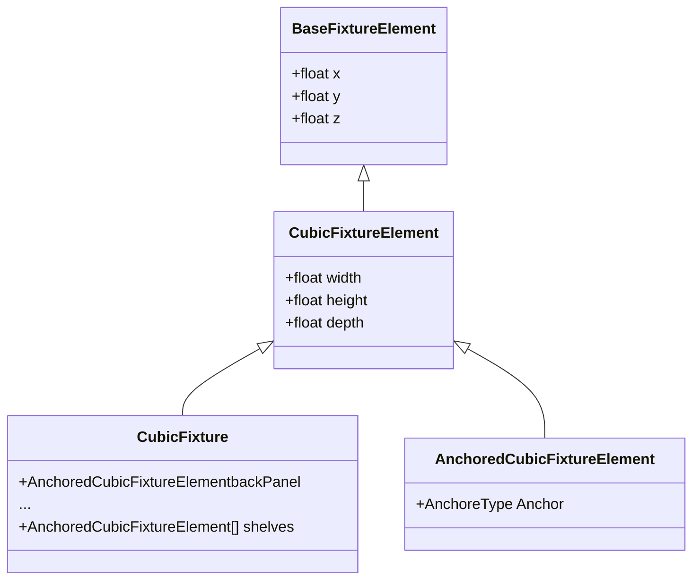

Hi there ! You will find in this document a few comments concerning my performance in the 'Fixture Challenge'.

# Context

I have received on the subject of the test since last Friday, and I have estimated the duration of the task to about a work day. Although I could not start working on it today (Tuesday),  I must admit the subject has been growing on me during the weekend.

Therefore, it is hard for me to estimate the theoretical/conception duration, but I started the day with a good idea where I was going, and how I wanted things to be done.

The whole implementation took me about 5 hours.
I spent the end of the day redacting this very document (about 2 hours).

*I did not write a lot of comments in the code itself, it seemed "readable enough" to me.
The few comments I added start with "AC 30/05" if you want to find them easily.*

# Implementation

## Serialization
Although the subject only mentions JSON files, I like to be flexible concerning serialization. In that sense, I used an abstract class **BaseSerializer**, and made a simple JSON implementation.

You will notice those serializers are ScriptableObjects, that let me change which system uses which serialization implementation on the fly.  
I kept this habit from working on game save files, in json during the development process and then in an encrypted format for release.
(I usually have the same approach for file saving and loading, but it was not that relevant in the context of this challenge).

## Fixture

### Simplified class diagram

### Comments
The data structure was basic, but I wanted a theoretical flexible implementation, therefore I started with an abstract class **BaseFixtureElement** which only contains a position.
The inherited class **CubicFixtureElement** contains the size.
*In the hypothesis of a "spherical" implementation, we could argue the size could serve as the size of bounding box of the element, and thus we could have it in the base abstract class...*

A **CubicFixture** inherits from **CubicElementFixture**, it is the structure I used to handle JSON data files.
It contains the different elements composing the fixture (backPanel, header, shelves...). 

The last class, **AnchoredCubicFixtureElement** is used to handle how an element is anchored, in order to simplify positioning them with regards to one another *(with regards to the fixture itself)*.
It simply recomputes the position of the element, based on its size *(and the size of the 'parent' element)* and an eventual position constraint *(such as the shelves y position)*.  
After the JSON file is deserialized, the **ApplyAnchor** method is used to make sure the size and position of each element are correct.

## Generation
### Implementation
*The idea is the same as for the serialization, I wanted to be able to implement different "generator", and be able to change swap between them easily.*

An abstract **BaseElementGenerator** contains an abstract method **Generate** to generate the visual for a given **BaseFixtureElement**, that uses a reference Transform in order to have a referenced position.

There is another abstract class **CubicElementGenerator**  inheriting from the previous one, but for **CubicFixtureElement**.

I ended up only making one implementation of this class, **CubicElementScaleGenerator**. This is a very basic implementation, that uses a cube and rescales it based on the element size. *You will notice that the cube in question has to have its pivot placed accordingly, more on that later on.*

Lastly, the **CubicFixtureGenerator** that is used to generate a whole **CubicFixture**
It has a **CubicElementGenerator** reference, to be able to choose a specific way to generate sub elements.

### Possible evolutions
As mentioned before the "Scale" implementation requires a specific cube to work out.
An obvious problem is that the pivot of the whole fixture is located on one of its corners.

Another implementation I envisioned was to create meshes at runtime, which could have simplified the positioning of each element with regards to one another. *(Moving the offset problem at vertex level)*

Both of those implementations present the same problem however : the cubes forming a fixture are overlapping  with one another, which would cause side rendering troubles for lighting or if we want to use different materials.

*A more "physical" approach could be considering an element tree, where the leaves "subtract" the size of their parent to prevent overlapping.*
*But a cleaner approach would be generating a single mesh of the whole fixture, which may cause side effect on the performances when working with more complex fixtures.*

With the ScriptableObject approach, any implementation mentioned before could be implemented and we could easily choose which one we would use for a specific case.

## FixtureHolder

This the MonoBehaviour class handling the fixture creation process.
As I mentioned before, the serializer and the generator used can be changed in the inspector.
Concerning the JSON data, I decided to simply store a TextAsset so it can also be changed in the inspector.

*I could not resist adding a simple color swap component to have a little feedback on the selection...*

## Interaction

### Selection

An interface **ISelectable** and a simple implementation **Selectable** (as a Monobehaviour).
Not much to say about it, except that it exposes UnityEvents to send callbacks on selection and deselection.
*(These UnityEvents are used by the color swap I mentioned before)*

### Replacement

An interface **IReplaceable** and a simple implementation **Replaceable**.
The **Replaceable** inherits from **Selectable**, in order to tie up both interactions together.

*We could also be using the distinct Monobehaviours, which would be useful to be able to disable replacement of a particular fixture for instance.*

The Scale generation presents its "limits" here : replacing a fixture based on its corner is not very user-friendly, and rotation or rescaling the fixture would not be instantly possible.
*A simple way to solve the pivot problem, while keeping the Scale generation could be simply offset locally each element after the whole generation process is completed, or to consider the offset during the position recomputation.* 

### Raycast

The **BaseRaycaster** abstract class simply implements the core raycast system, based on a mouse click and the mouse position "on screen". *(It uses the old input system)*
The logic of "what is done when the raycast hits or not" is abstract.

**SelectableRaycaster** implements the selection logic: only one **Selectable** can be selected at a time, and it is deselected when clicking on nothing or on a non-selectable object.

**ReplacementRaycaster** modifies the previously described behaviour, to be able to move the selected object (if it implements the **IReplaceable** interface).

## Unit Testing
I took the liberty to implement some unit tests, but they only cover the most obvious use cases.
The use of some of the Mock class implementation could have bypassed by turning some method public, but in my opinion I would rather keep them protected (in most cases), to keep the code easier to read and use functionality-wise. 

# Conclusion
Although the subject was quite simple, I enjoyed the liberty of approach it offers.
I hope this document and this rendition finds you well.

Best Regards,
Anatole Chaumont
